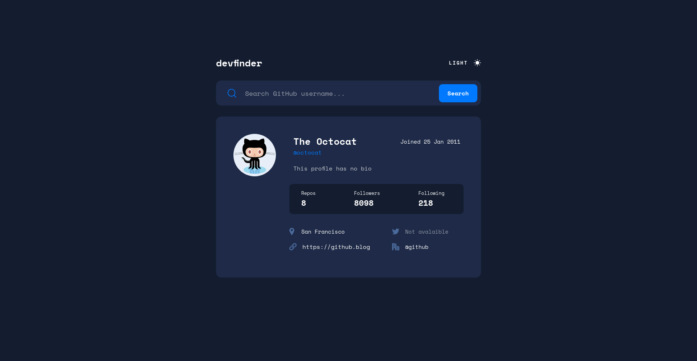

## Table of contents

- [Overview](#overview)
  - [Screenshot](#screenshot)
  - [Links](#links)
- [My process](#my-process)
  - [Built with](#built-with)
  - [What I learned](#what-i-learned)
- [Author](#author)

## Overview

### Screenshot



### Links

- Solution URL: [Check Here](https://www.frontendmentor.io/solutions/responsive-github-username-finder-gs-UeT9pHb)
- Live Site URL: [Check Here](https://unique-lamington-7b8a40.netlify.app/)

## My process

### Built with

- Semantic HTML5 markup
- CSS custom properties
- Flexbox
- CSS Grid
- Vanilla JS

### What I learned

```css
// sets the color of the insertion caret
.search_bar > input {
  caret-color: var(--primary-blue);
}
```

## Author

- Frontend Mentor - [@yourusername](https://www.frontendmentor.io/profile/yourusername)
